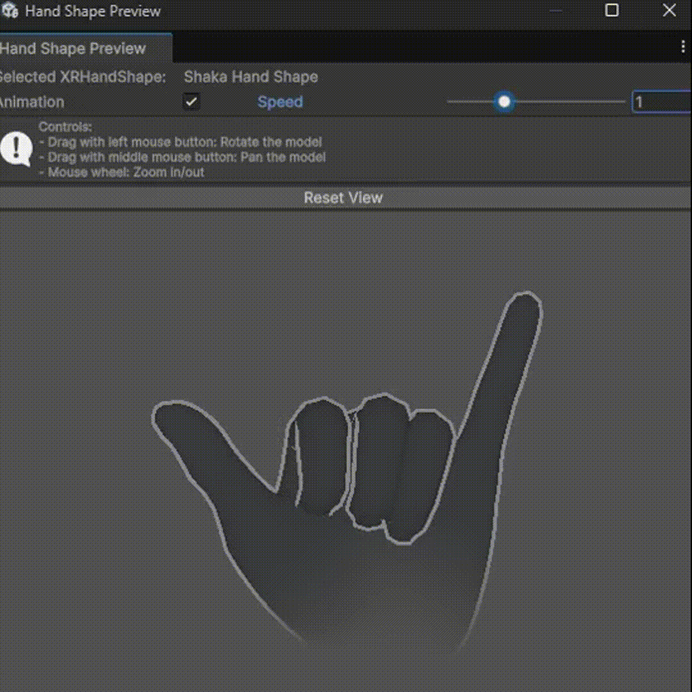

# XR HandShape Viewer for Unity

An **Editor‑only** window that lets you preview  `XRHandShape` ScriptableObjects in 3D, directly inside the Unity Editor.

---

## 

---

## Features

* One‑click **Open 3D Preview** button in the `XRHandShape` inspector
* Interactive controls – rotate, pan, zoom the hand model
* Optional auto‑animation that sweeps through tolerance ranges

---

## Installation

### Via Unity Package Manager (Git URL)

1. Open **Window ▸ Package Manager**.
2. Click the **+** drop‑down ▸ **Add package from Git URL…**
3. []

---

## Quick Start

1. Select any `XRHandShape` asset in the Project window.
2. In the Inspector click **Open 3D Preview** _or_ open the window via menu.
3. Use the mouse:
   * **LMB drag** – rotate
   * **MMB drag** – pan
   * **Scroll wheel** – zoom
4. Toggle **Animation** and adjust **Speed** to view tolerance blending.

---

## Requirements

* Unity **6000.0** or newer
* `com.unity.xr.hands` ≥ 1.5.0 (declared as dependency)

---

## License

MIT – do what you want, attribution appreciated.
